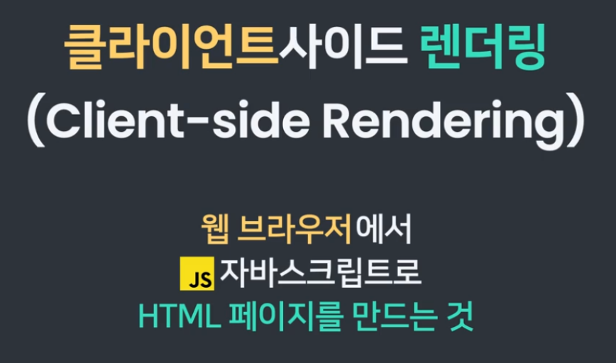

리액트 라우터 구현의 중요한 특징

React Router의 Link 태그로 사이트를 이동하게 되면
기존 HTML 리퀘스트 방식으로 이동하지 않는다. (a 태그 방식 x)
(개발자 도구 Network 탭에서 확인해도, 리퀘스트 신호가 잡히지 않는다.)

대신에 자바스크립트로 웹 페이지를 만들어 내며
이동한 것처럼 흉내를 낸다.

서버에서 렌더링하는 것이 아니라 html 문서를 모두 가지고 있는 상태에서
컴포넌트 재조합 만으로 페이지를 새로 만들어 내기 때문에
**클라이언트 사이드 렌더링**이라고 부르며 싱글 페이지 애플리케이션의 중요 특징이다.

